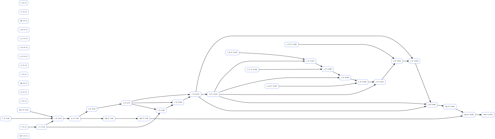

!!! This is a repo completely built by codex and claude code, python file is produced by codex, readme and building repo is done by Claude Code

# V_intri - RVV Intrinsics Visualizer

A powerful tool for visualizing RISC-V Vector (RVV) intrinsic kernels with dependency graphs and liveness analysis.

## Overview

This tool parses RVV intrinsic code written in C/C++, builds variable dependency graphs, performs SSA versioning, and provides comprehensive visualization and analysis capabilities including:

- **Dependency Graph Visualization**: Interactive SVG graphs showing data flow between variables
- **SSA Versioning**: Automatic static single assignment conversion for cleaner analysis
- **Time-indexed Analysis**: Each statement is assigned a sequential time index for temporal analysis
- **Liveness Analysis**: Track vector register pressure over time with detailed interval analysis
- **Multiple Output Formats**: SVG, PNG, and JSON export capabilities

## Features

### 🔍 Code Analysis
- Parses RVV intrinsics-style code with lightweight macro normalization
- Extracts statements, variables, and data dependencies automatically
- Supports both raw and SSA (Static Single Assignment) analysis modes

### 📊 Visualization
- **Built-in SVG/PNG renderer**: Time-aligned layout with curved edges
- **Graphviz integration**: Automatic layout with spline routing
- **Interactive GUI preview**: Tkinter-based viewer for immediate feedback
- **Time-aligned layout**: Nodes grouped by statement execution order

### 📈 Liveness Analysis
- **Vector register tracking**: Monitor register pressure over time
- **Interval analysis**: Track live ranges for each variable
- **JSON export**: Machine-readable liveness data for integration
- **Scalar separation**: Automatic filtering of scalar variables (prefixed with `s_`)

## Quick Start

### Installation
```bash
git clone https://github.com/Rubiczhang/v_intri.git
cd v_intri
```

### Basic Usage
Run with the built-in sample to see immediate results:
```bash
python3 visualize_intrinsics.py --sample
```

This will generate `graph.svg` showing the dependency graph of the sample kernel.

### Sample Results

The sample kernel demonstrates a complex RVV computation with the following characteristics:

#### Nodes (Time-indexed SSA Variables)
```
Parameters (t=-1): c3, c5, c7, c9, half, n, ni, odd, r, r2, r3, tmp, v, vc3, vc5, vc7, vl, y

Computation:
t=0:  n_f1
t=1:  half_f1
t=2:  r_f1
t=3:  n_f2
t=4:  ni_f1
t=5:  n_f3
t=6:  odd_f1
t=7:  n_f4
t=8:  odd_f2
t=9:  r_f2
t=10: r_f3
t=11: r_f4
t=12: r2_f1
t=13: r3_f1
t=14: c9_f1
t=15: c7_f1
t=16: c5_f1
t=17: c3_f1
t=18: y_f1
t=19: vc7_f1
t=20: y_f2
t=21: vc5_f1
t=22: y_f3
t=23: vc3_f1
t=24: y_f4
t=25: y_f5
t=26: tmp_f1
t=27: tmp_f2
t=28: return
```

#### Dependency Graph Edges
```
c3_f1 -> vc3_f1
c5_f1 -> vc5_f1
c7_f1 -> vc7_f1
c9_f1 -> y_f1
half_f1 -> n_f2
n_f1 -> n_f2
n_f2 -> ni_f1
n_f3 -> n_f4
n_f4 -> r_f2
n_f4 -> r_f3
n_f4 -> r_f4
ni_f1 -> n_f3
ni_f1 -> odd_f1
odd_f1 -> odd_f2
odd_f2 -> tmp_f2
r2_f1 -> r3_f1
r2_f1 -> y_f2
r2_f1 -> y_f3
r2_f1 -> y_f4
r3_f1 -> y_f5
r_f1 -> n_f2
r_f1 -> r_f2
r_f2 -> r_f3
r_f3 -> r_f4
r_f4 -> r2_f1
r_f4 -> r3_f1
r_f4 -> y_f5
tmp_f1 -> tmp_f2
tmp_f2 -> return
v -> r_f1
vc3_f1 -> y_f4
vc5_f1 -> y_f3
vc7_f1 -> y_f2
y_f1 -> y_f2
y_f2 -> y_f3
y_f3 -> y_f4
y_f4 -> y_f5
y_f5 -> tmp_f1
```

#### Liveness Analysis (Register Pressure)
```
t=0:  1 alive  -> n_f1
t=1:  2 alive  -> half_f1, n_f1
t=2:  3 alive  -> half_f1, n_f1, r_f1
t=3:  4 alive  -> half_f1, n_f1, n_f2, r_f1
t=4:  3 alive  -> n_f2, ni_f1, r_f1
t=5:  3 alive  -> n_f3, ni_f1, r_f1
t=6:  4 alive  -> n_f3, ni_f1, odd_f1, r_f1
t=7:  4 alive  -> n_f3, n_f4, odd_f1, r_f1
t=8:  4 alive  -> n_f4, odd_1, odd_f2, r_f1
t=9:  4 alive  -> n_f4, odd_f2, r_f1, r_f2
t=10: 4 alive  -> n_f4, odd_f2, r_f2, r_f3
t=11: 4 alive  -> n_f4, odd_f2, r_f3, r_f4
t=12: 3 alive  -> odd_f2, r2_f1, r_f4
t=13: 4 alive  -> odd_f2, r2_f1, r3_f1, r_f4
t=14: 5 alive  -> c9_f1, odd_f2, r2_f1, r3_f1, r_f4
t=15: 6 alive  -> c7_f1, c9_f1, odd_f2, r2_f1, r3_f1, r_f4
t=16: 7 alive  -> c5_f1, c7_f1, c9_f1, odd_f2, r2_f1, r3_f1, r_f4
t=17: 8 alive  -> c3_f1, c5_f1, c7_f1, c9_f1, odd_f2, r2_f1, r3_f1, r_f4
t=18: 9 alive  -> c3_f1, c5_f1, c7_f1, c9_f1, odd_f2, r2_f1, r3_f1, r_f4, y_f1
t=19: 9 alive  -> c3_f1, c5_f1, c7_f1, odd_f2, r2_f1, r3_f1, r_f4, vc7_f1, y_f1
t=20: 9 alive  -> c3_f1, c5_f1, odd_f2, r2_f1, r3_f1, r_f4, vc7_f1, y_f1, y_f2
t=21: 8 alive  -> c3_f1, c5_f1, odd_f2, r2_f1, r3_f1, r_f4, vc5_f1, y_f2
t=22: 8 alive  -> c3_f1, odd_f2, r2_f1, r3_f1, r_f4, vc5_f1, y_f2, y_f3
t=23: 7 alive  -> c3_f1, odd_f2, r2_f1, r3_f1, r_f4, vc3_f1, y_f3
t=24: 7 alive  -> odd_f2, r2_f1, r3_f1, r_f4, vc3_f1, y_f3, y_f4
t=25: 5 alive  -> odd_f2, r3_f1, r_f4, y_f4, y_f5
t=26: 3 alive  -> odd_f2, tmp_f1, y_f5
t=27: 3 alive  -> odd_f2, tmp_f1, tmp_f2
t=28: 2 alive  -> return, tmp_f2
```

**Key Observations:**
- **Peak register pressure**: 9 registers at time steps t=17, t=18, t=19, and t=20
- **Total execution time**: 29 time steps (t=-1 to t=28)
- **Complex dependency chain**: Demonstrates data flow through multiple computation phases
- **Efficient register usage**: Shows realistic register pressure patterns for RVV code

### Sample Visualization

Here's the generated dependency graph from the sample kernel:



This graph shows:
- **Nodes**: Each SSA variable with its time index (`[t=N]`)
- **Edges**: Data dependencies between variables
- **Layout**: Time-aligned from left to right (t=0 to t=28)
- **Colors**: Different node types (parameters, computations, return)
- **Curved paths**: Minimize edge overlap for better readability

## Advanced Usage

### Analyze Your Own Code
```bash
python3 visualize_intrinsics.py --input your_kernel.cpp --stage ssa --align time --out your_graph.svg
```

### Export Liveness Data
```bash
python3 visualize_intrinsics.py --input your_kernel.cpp --dump-liveness --liveness-json liveness.json
```

### Graphviz Backend (Higher Quality)
```bash
python3 visualize_intrinsics.py --input your_kernel.cpp --backend graphviz --out high_quality_graph.png
```

## Requirements

- Python 3.8+
- Optional dependencies:
  - Pillow (`pip install pillow`) for PNG output
  - Tkinter (usually included) for GUI preview
  - Graphviz binaries for enhanced rendering

## Command Line Options

| Option | Description | Default |
|--------|-------------|---------|
| `--input/-i FILE` | Input source file | Use `--sample` |
| `--sample` | Use built-in sample | Off |
| `--stage raw|ssa` | Analysis stage | `ssa` |
| `--align rank|time` | Layout method | `time` |
| `--backend auto|builtin|graphviz` | Rendering backend | `auto` |
| `--out/-o PATH` | Output file path | `graph.svg` |
| `--dump-nodes` | List nodes with time | Off |
| `--dump-edges` | List edges | Off |
| `--dump-liveness` | Show register pressure | Off |
| `--liveness-json FILE` | Export liveness to JSON | Off |

## Applications

- **Compiler Development**: Understand register pressure in RVV kernels
- **Performance Analysis**: Identify optimization opportunities in vector code
- **Educational**: Visualize data dependencies in vector computations
- **Research**: Analyze and compare different RVV coding patterns

## License

This project is open source and available under the MIT License.

## Contributing

Contributions are welcome! Please feel free to submit issues and pull requests.

---

For more detailed information about the implementation and advanced features, see the [technical documentation](https://github.com/Rubiczhang/v_intri/wiki).
